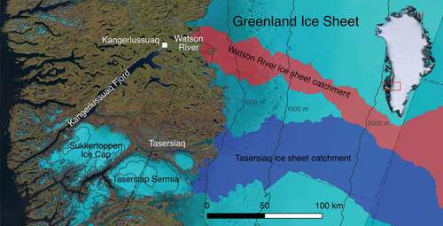

# Correlations Between Watson River Width and Water Surface Elevation and Supraglacial Runoff  
### Jasper Heuer, Camryn Kluetmeier, Maya Maciel-Seidman 

We plan to investigate how fluctuations in proglacial river width and water surface elevation (wse) correlate to supraglacial runoff through a case study of the Watson River basin in southwest Greenland during summer 2024. We will leverage group members’ research expertise by incorporating optical remote sensing classification, radar remote sensing, and modeling at the intersection of hydrology and cryospheric studies.  

## Question:
Are fluctuations in proglacial river width and water surface elevation correlated to supraglacial runoff?

## Datasets:
* [MAR version 3.14](https://zenodo.org/records/13151275)
* [Sentinel-2 surface reflectance imagery](https://browser.dataspace.copernicus.eu/?zoom=5&lat=50.16282&lng=20.78613&demSource3D=%22MAPZEN%22&cloudCoverage=30&dateMode=SINGLE)
* [SWOT River SP PID0](https://search.earthdata.nasa.gov/search?q=SWOT)
* [SWORD](https://www.swordexplorer.com/)

## Python Packages:
* Os
* Numpy
* Xarray
* Pandas
* Sklearn
* Rasterio
* Geopandas
* Matplotlib
* Gdal

## Planned Approach
Maya will use MAR 2024 output to derive total meltwater runoff for the catchment by aggregating the 5km grid cells which contain the Watson River Catchment. Jasper will use Sentinel-2/Landsat/Planet imagery to produce water masks of the proglacial reaches of the Watson River and effective width estimates using an image classification algorithm or threshold (e.g. RF, CNN, NDWI). Camryn will filter SWOT vector products to generate water surface elevation and width estimates for the same reaches of the Watson River. Proglacial width and wse estimates from SWOT and optical imagery will be attributed to the SWOT prior river database (SWORD) reaches (10km) and nodes (200m) for intercomparisons. Finally, the summer 2024 timeseries of proglacial river width and wse with be compared with MAR total basin runoff to investigate if proglacial river processes can be used as a predictor of supraglacial meltwater runoff. 

## Expected Outcomes:
* Final data products (temporal resolution depending on data availability):
  - Timeseries of effective width based on Sentinel-2 landcover classification, temporal resolution to be determined based on cloud-free imagery
  - Timeseries of wse and effective width based on SWOT vector products, temporal resolution to be determined based on data quality filtering
  - Daily timeseries of generate melt/runoff from MAR
* Insights:
  - Degree of correlation between effective width/wse and MAR runoff/melt
  - Better understanding of whether effective width/wse data can be used to predict/validate MAR runoff/melt estimates

## Study Area:

## Team:

## References:
Mankoff et al. (2020): Greenland liquid water discharge from 1958 through 2019 

Van As et al. (2018): Reconstructing Greenland Ice Sheet meltwater discharge through the Watson River (1949–2017) 
